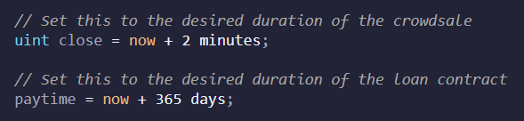
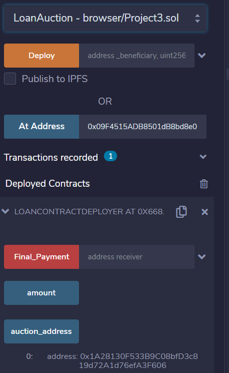
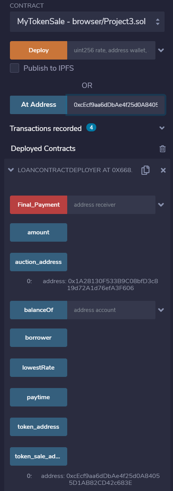
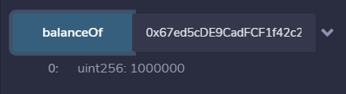
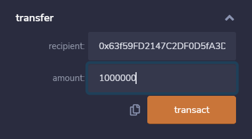
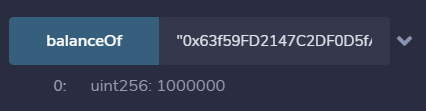
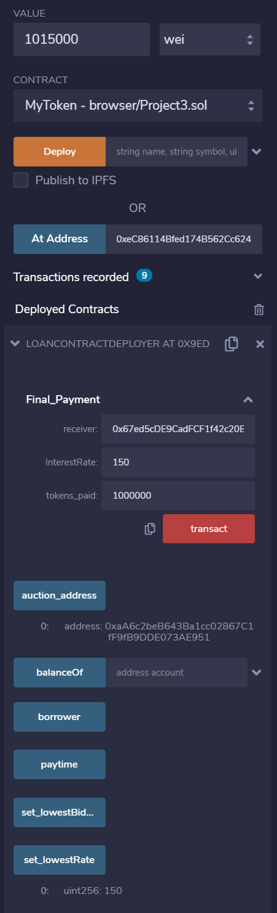
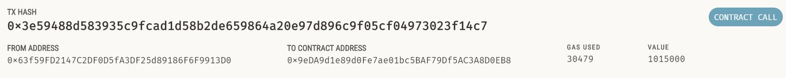

## Full Contract Documentation

### 1. Loan Contract Deployment

Before deploying there are certain time variables that can be established within the contract code. The limitations of solidity do not allow for time to be combined with uint variables as of March 2021. The two sections of time are for the crowdsale duration and loan contract duration. These will be preset at 7 days and 1 year; however, should one wish to test this contract it would be appropriate to change these to a smaller amount of time.

- Provide a name for the token, symbol, wallet address of the borrower, funding goal of the borrower, and maximum amount to be raised by the borrower.

Note: The cap amount is a functionality placeholder. In this version the bidders (large banks) may only bid for the goal amount. Also note the time begins at deployment so it will be important to factor in the auction and crowdsale times together for the close variable as well as for the final payment on the loan.

### 2. Loan Auction Deployment

Use the loan auction address created by deploying the first contract to allow for the bidding by large major banks. The lowest bidder will win the auction and the rate entered will be used for the interest payment final calculation. The ether will be transferred to the borrower in exchange for the right to issue tokens on behalf of the borrower. When the borrower is satisfied with the auction results they can use the endAuction function to close the auction. Losing bidders can withdraw their ether with the withdraw function.

Note: Improvements to this contract would include a self-destruct feature if the auction is not ended within a certain time. This would return ether to the bidders automatically.

### 3. MyTokenSale Deployment

Use the token_sale_address created by deploying the first contract to allow for the crowdsale to begin. The winning bidder will be the beneficiary of this token sale and the tokens will represent the loan obligation of the borrower. Both the goal and the close time must be met for the crowdsale to complete. If they do not, the refundable crowdsale will return ether and tokens to the respective parties. 

### 4. MyToken Deployment

Within the ERC20 token contract is a transfer function. To be repaid the borrowed ether, the lender must transfer his or her tokens back to the borrower and the borrower will execute the Final_Payment function to transfer the principal and interest. If this does not happen legal action can be taken against the borrower as per the loan contract agreement.

### 5. Final_Payment

The borrower will need to verify receipt of the tokens before processing the final payment. After doing so, the lender address, interest rate, and token amount can be entered to the function to process the final payment. The amount of ether transferred (what is entered in the value box of remix) must be the exact amount of interest and principal or the payment will not process.

Note: Due to the limitations of solidity to handle float (decimals) the interest rate must be in basis points. Use the set_LowestRate() function to see the interest rate on the loan amount.
