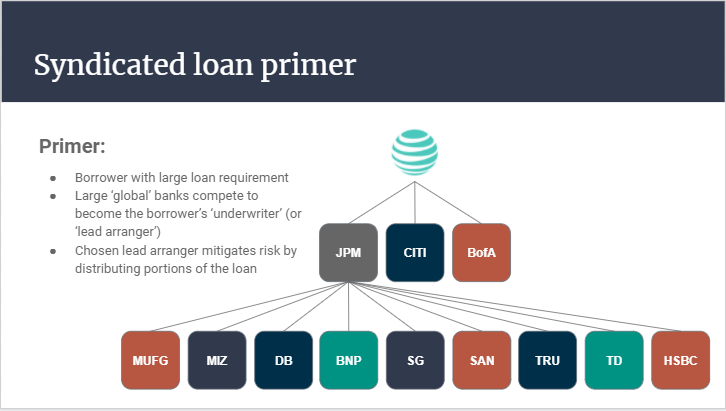
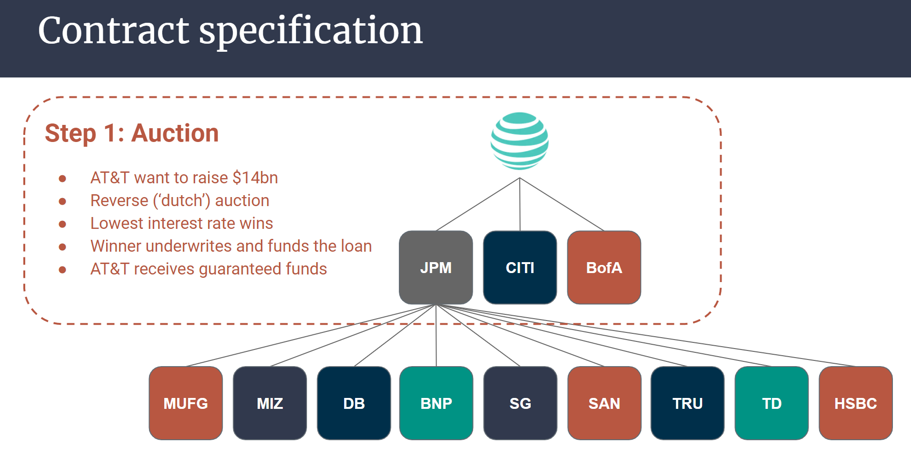
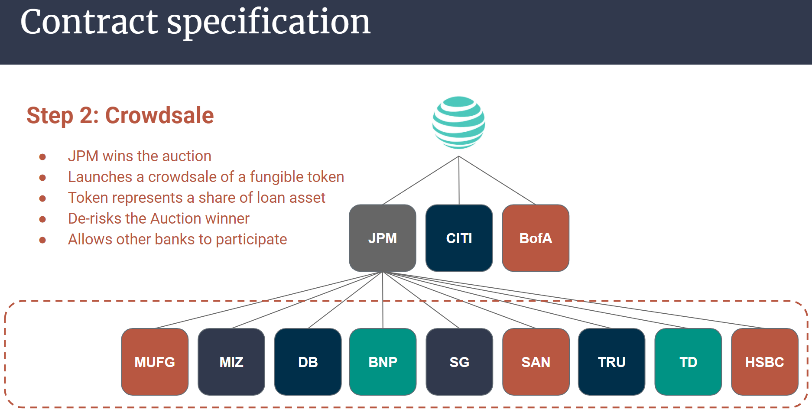
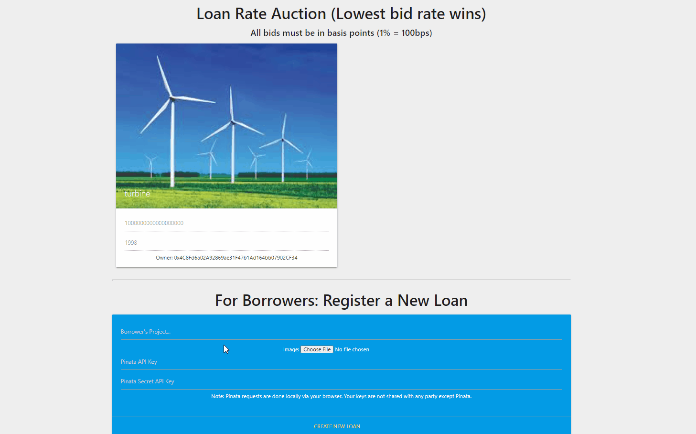

# Loan Syndication on Blockchain (using Smart Contracts)
### Tokenizing syndicated loans using smart contracts on the ethereum blockchain

Code developed by Arthur Moran, Ben Fischler, Eli Holden, Nika Chan and Phil Waddilove

### Table of Contents
1. [Introduction](#Introduction)
2. [Reverse Auction Smart Contract to set the Borrower's Interest Rate](#auction)
    - a. [How syndicate managers are chosen today](#manager)
    - b. [Our solution: Reverse Auction](#reverseauction)
    - c. [Auction Contract Functions](#auctionfunctions)
3. [Crowdsale Smart Contract to distribute loan risk](#crowdsale)
    - a. [How risk distribution works today](#distribution)
    - b. [Our solution: Crowdsale](#crowdsalecontract)
    - c. [Crowdsale Contract Functions](#crowdsalefunctions)  
4. [Benefits of doing loan syndication on the Blockchain](#blockchain)
5. [Limitations and What can be Improved](#Conclusion)
6. [Considerations for Grading](#Grading)
7. [Contract Deployment Instructions](#instructions)
8. [Appendix](#Appendix)
9. [D-app Demo](#Demo)

&nbsp;

## 1. Introduction 
    
In this project, we replicate the loan syndication process using smart contracts built on the Ethereum blockchain.  Loan syndication is the process of involving a group of lenders in funding portions of a loan for a single borrower. It most often occurs when the borrower requires an amount that is too large for any single bank to provide. 

## 2. Reverse Auction Smart Contract to set the Borrower's Interest Rate 

### a. How Lead Arrangers are chosen today 

Today, potential 'underwriters' (or 'lead arrangers') submit offers to the borrower in a tender, bid, or auction process.  This offer usually specifies an interest rate, a fee, and high level terms which the lead arranger believes are 'market clearing' (i.e. terms at which a syndicate of banks would be willing to lend to the borrower).  In a competitive market, the winning offer should comprise the lowest interest rate and fee combination.

The underwriter who 'wins' this tender, bid, or auction process then guarantees the funds to the borrower at the terms specified.  It is then incumbent on the underwriter/ lead arranger to distribute the loan to an interested pool of participant banks.

We estimate that the volume of commercial loans made to corporates in North America is circa $2.1trn per annum, with estimated fees of >$10bn paid to banks involved in the underwriting, arrangement, execution, and administration of such loans.

### b. Our solution: Reverse Auction 

Our solution is to replace the archaic process of calling and requesting for proposals from several banks. a Reverse Auction via smart contracts makes the process faster and more transparent. It also has the potential benefit of lowering the interest rate for the borrower. In this section of the smart contract, we are using the openzeppelin auction library to conduct an auction where banks bid for the loan by submitting an "interest rate bid", the winner of the auction is the bank that submits the lowest interest rate. Below is an example of a borrower with a large loan requirement going through the smart contract.

### c. Auction Contract Functions 

| Function | Description |
| ------ | ----------- |
| `bid`   | For prospective underwriters to bid, requires address and interest rate bid |
| `endAuction` | For deployer to end auction |
| `withdraw`    | For losing bidders to withdraw their ETH |
| `AuctionEnded`    | Call function to check if auction has ended. Returns true or false  |
| `balance`    | Call function to check balance in auction contract |
| `beneficiary`    | Call function to show where the ETH from auction goes. In this example, beneficiary is the Borrower |
| `deployer`    | Call function to show wallet of deployer. In this example, deployer is Borrower |
| `get_lowestBidder`    | Call function to show address of current lowest bidder |
| `get_lowestRate`    | Call function to show current lowest rate |
| `get_BidList`    | Call Function to show bid value of an address. In this example, bid value must equal the entire loan amount  |
| `goal`    | Call function to show borrower's loan amount |
| `lowestBid`    | Call function to show lowest bid value. In this example, bid value must equal the entire loan amount  |
| `lowestBidder`    | Call function to show address of current lowest bidder |
| `lowestRate`    | Call function to show current lowest rate |

## 3. Crowdsale Smart Contract to distribute loan risk 

### a. How risk distribution works today 

Today, the syndication (or distribution) process involves the underwriter contacting and coordinating with potentially interested participants.  This process gauges investor appetite, organizes investor materials, coordinates the credit approval process accross the participant banks, and drafts loan documentation (with legal council).  The whole process can take four to six weeks, and a large loan syndication might require forty participants.

Participants who may wish to trade the loan in future do not always know who owns it and who may want to buy it.  These banks often have to cross a trading desk (and potentially paying a fee to the underwriter) to do so.

### b. Our solution: Crowdsale 

Our solution is to deploy a token crowdsale to replace the manual process of calling up other banks to participate in the loan. The lead arranger, having won the loan from the reverse auction, now has the right to mint fungible tokens that other lenders can buy in exchange for Ether. These tokens are made fungible to make them tradeable between lenders. Following through with our previous example, the diagram below shows how the crowdsale would work.

### c. Crowdsale Contract Functions 

| Function | Description |
| ------ | ----------- |
| `buyTokens`   | For syndicate banks to buy portions of the loan in exchange for tokens, requires beneficiary |
| `claimRefund` | For syndicate banks to get refund of ETH if crowdsale is unsuccessful |
| `finalize`    | For crowdsale deployer to end crowdsale |
| `withdrawTokens`    | For syndicate banks to withdraw SYN tokens|
| `balanceOf`    | Call function to check balance of address submitted |
| `cap`    | Call function to show crowdsale cap |
| `capReached`    | Call function to show whether cap is reached. Returns true or false |
| `closingTime`    | Call function to show time left in crowdsale |
| `finalized`    | Call function to show if crowdsale has been finalized. Returns true or false |
| `goal`    | Call function to show crowdsale goal amount |
| `goalReached`    | Call function to show if goal has been reached. Returns true or false |
| `hasClosed`    | Call function to show if crowdsale opening period has expired. Returns true or false |
| `isOpen`    | Call function to show if crowdsale is open. Returns true or false |
| `openingTime`    | Call function to show time of contract deployment and in this example, crowdsale opening as well |
| `rate`    | Call function to show ETH:SYN token conversion rate |
| `token`    | Call function to show token address |
| `wallet`    | Call function to show crowdsale deployer wallet. In this case, the underwriter |
| `weiRaised`    | Call function to show how much wei is currently raised |

## 4. Benefits of doing loan syndication on the Blockchain 

For the underwriter/ lead arranger, we believe there may be significant cost savings to the administration of the bidding and syndication process.  For the participant banks, more transpancy and liquidity for the class of fungible tokens minted in the process may enable more widespread trading of loan assets.  In a competitive market the borrower should ultimately be able to achieve lower rates and fees.  

## 5. Limitations and What can be Improved  

There is no native automation of periodic process in solidity.  A user has to call a function.  Syndicated loans are usually structured with periodic interest payments (at three month or six month intervals for example).  At the moment interest is calculated by the borrower and added to principal remapyment at the end of the loan term.  Automation may require a web3 solution in Python.

Optimization of Auction and Crowdsale contracts to minimize gas costs in deployment.

## 6. Considerations for Grading 

- Fintech application: Created a loan syndication d-app
- Tools used: Used OpenZeppelin for the smart contracts, Ganache for our wallet

## 7. Contract Deployment Instructions 

1. In Remix, compile [the solidity contract file](Code/SYN.sol)

2. Select `LoanContractDeployer` from the contract dropdown in the deployment section of Remix

3. Provide a name for the token, symbol, wallet address of the borrower, funding goal of the borrower, and maximum amount to be raised by the borrower and click on transact. This should generate a contract called **LOANCONTRACTDEPLOYER AT 0x**

4. Select `LoanAuction` from the contract dropdown in the Deployment section of Remix

5. Copy the `auction_address` from **LOANCONTRACTDEPLOYER AT 0x** and paste it into the `At Address` field of the deployment section. Click on the `At Address` button and this should generate a new contract named **LOANAUCTION AT 0x**.

6. Competing syndicate managers can use the `bid button` under **LOANAUCTION AT 0x** to bid for the full amount of the loan at the lowest interest rate they are willing to receive.

7. To close the auction, click on the `endAuction` button under the **LOANAUCTION AT 0x** contract. Lowest interest rate bidder wins the auction, his ETH goes to the borrower in exchange for the right to issue tokens on behalf of the borrower. Losers can withdraw their ETH using the `withdraw` button.

8. Select `MyTokenSale` from the contract dropdown in the Deployment section of Remix

9. Copy the token_sale_address from the **LOANCONTRACTDEPLOYER AT 0x** contract and paste it into the `At Address` field of the deployment section. Click on the `At Address` button and this should generate a new contract named **MYTOKENSALE AT 0x**.

10. Banks who want to participate in the funding of the large loan can buy SYN tokens using the `buyTokens` button.

11. Once the crowdsale is compelete, click on the `finalize` function to end the crowdsale.

12. To process the final payment (borrower pays back the full notional + interest), go back to **LOANCONTRACTDEPLOYER AT 0x** and click on `Final_Payment`, fill in the fields for each participating bank and click on transact

[See Full Documentation Here](Code/README.md)

## 8. Appendix 

- This contract's Github Page: [Loan Syndication Github Page](https://nikanikachan.github.io/p3_loansyndication/)
- **Dependencies:** Solidity, Remix, Ganache, Metamask
- [Presentation Slides](https://github.com/Luminous171/Project_3/blob/main/2021-03-16%20-%20Loan%20Syndication.pdf)

## 9. D-app Demo 

- Your metamask should be in the Ropsten network to see all the features
- Note that for the purpose of this demo, the loan amount has been set to 1 ETH for easier testing.
- Click [here](https://nikanikachan.github.io/p3_loansyndication/Frontend/index.html) to launch the Auction user interface of our loan syndication contract in your browser.

If you do not have Metamask installed, See GIF demo below:

